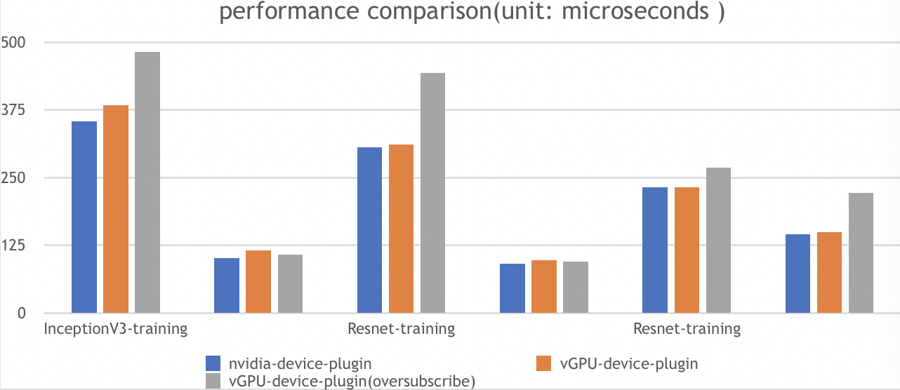

# VGPU device plugin for Kubernetes

English version|[中文版](README_cn.md)

[](https://travis-ci.com/github/4paradigm/k8s-device-plugin)

## Table of Contents

- [About](#about)
- [Features](#Features)
- [Experimental Features](#Experimental Features)
- [Known Issues](#Known Issues)
- [TODO](#TODO)
- [Prerequisites](#prerequisites)
- [Quick Start](#quick-start)
  - [Preparing your GPU Nodes](#preparing-your-gpu-nodes)
  - [Enabling vGPU Support in Kubernetes](#enabling-vgpu-support-in-kubernetes)
  - [Running GPU Jobs](#running-gpu-jobs)
- [Tests](#Tests)
- [Benchmarks](#Benchmarks)
- [Issues and Contributing](#issues-and-contributing)

## About

The **VGPU device plugin** is based on NVIDIA device plugin([NVIDIA/k8s-device-plugin](https://github.com/NVIDIA/k8s-device-plugin)), and on the basis of retaining the official features, it splits the physical GPU, and limits the memory and computing unit, thereby simulating multiple small VGPU cards. In the k8s cluster, scheduling is performed based on these splited VGPUs, so that different containers can safely share the same physical GPU and improve GPU utilization.

## Features

- Specify the number of VGPUs divided by each physical GPU.
- Limit VGPU's Global Memory.
- Limit VGPU's Streaming Multiprocessor.

## Experimental Features

- Global Memory overuse

  The Global Memory of the VGPU can exceed the actual Global Memory of the GPU. At this time, the excess part will be put in the RAM, which will have a certain impact on the performance.

## Known Issues

- When the Global Memory is overused, if the Global Memory of a physical GPU is used up and there are vacant VGPUs on this GPU, the tasks assigned to these VGPUs will fail.
- Currently, only computing tasks are supported, and video codec processing is not supported.

## TODO

- Support video codec processing
- Support Multi-Instance GPUs (MIG)

## Prerequisites

The list of prerequisites for running the NVIDIA device plugin is described below:
* NVIDIA drivers ~= 384.81
* nvidia-docker version > 2.0
* Kubernetes version >= 1.10

## Quick Start

### Preparing your GPU Nodes

The following steps need to be executed on all your GPU nodes.
This README assumes that the NVIDIA drivers and `nvidia-docker` have been installed.

Note that you need to install the `nvidia-docker2` package and not the `nvidia-container-toolkit`.
This is because the new `--gpus` options hasn't reached kubernetes yet. Example:

```
# Add the package repositories
$ distribution=$(. /etc/os-release;echo $ID$VERSION_ID)
$ curl -s -L https://nvidia.github.io/nvidia-docker/gpgkey | sudo apt-key add -
$ curl -s -L https://nvidia.github.io/nvidia-docker/$distribution/nvidia-docker.list | sudo tee /etc/apt/sources.list.d/nvidia-docker.list

$ sudo apt-get update && sudo apt-get install -y nvidia-docker2
$ sudo systemctl restart docker
```

You will need to enable the nvidia runtime as your default runtime on your node.
We will be editing the docker daemon config file which is usually present at `/etc/docker/daemon.json`:

```
{
    "default-runtime": "nvidia",
    "runtimes": {
        "nvidia": {
            "path": "/usr/bin/nvidia-container-runtime",
            "runtimeArgs": []
        }
    }
}
```

> *if `runtimes` is not already present, head to the install page of [nvidia-docker](https://github.com/NVIDIA/nvidia-docker)*

### Enabling vGPU Support in Kubernetes

Once you have configured the options above on all the GPU nodes in your
cluster, remove existing NVIDIA device plugin for Kubernetes if it already exists. Then, you can download our Daemonset yaml file by following command:

```
$ wget https://gitlab.4pd.io/peizhaoyou/k8s-device-plugin/raw/63ce301055065cd676e525742268f95cfe6b25c8/nvidia-device-plugin.yml
```

In this Daemonset file, you can see the container `nvidia-device-plugin-ctr` takes four optional arguments to customize your vGPU support:

* `fail-on-init-error:`  
  Boolean type, by default: true. When set to true, the failOnInitError flag fails the plugin if an error is encountered during initialization. When set to false, it prints an error message and blocks the plugin indefinitely instead of failing. Blocking indefinitely follows legacy semantics that allow the plugin to deploy successfully on nodes that don't have GPUs on them (and aren't supposed to have GPUs on them) without throwing an error. In this way, you can blindly deploy a daemonset with the plugin on all nodes in your cluster, whether they have GPUs on them or not, without encountering an error. However, doing so means that there is no way to detect an actual error on nodes that are supposed to have GPUs on them. Failing if an initilization error is encountered is now the default and should be adopted by all new deployments.
* `device-split-count:` 
  Integer type, by default: 2. The number for NVIDIA device split. For a Kubernetes with *N* NVIDIA GPUs, if we set `device-split-count` argument to *K​*, this Kubernetes with our device plugin will have *K \* N* allocatable vGPU resources. Notice that we suggest not to set device-split-count argument over 5 on NVIDIA 1080 ti/NVIDIA 2080 ti, over 7 on NVIDIA  T4, and over 15 on NVIDIA A100.
* `device-memory-scaling:` 
  Float type, by default: 1. The ratio for NVIDIA device memory scaling. For NVIDIA GPU with *M* memory, if we set `device-memory-scaling` argument to *S*, vGPUs splitted by this GPU will totaly get *S \* M* memory in Kubernetes with our device plugin. The memory of each vGPU is also affected by argument `device-split-count`. For previous example, if `device-split-count` argument is set to *K*, each vGPU finally get *S \* M / K* memory.
* `device-cores-scaling:` 
  Float type, by default: 1. The ratio for NVIDIA device cores scaling, can be greater than 1. If the `device-cores-scaling` parameter is configured as *S* and the `device-split-count` parameter is configured as *K*, then the average upper limit of sm utilization within **a period of time** corresponding to each vGPU is *S / K*. The sum of the utilization rates of all vGPU sm belonging to the same physical GPU does not exceed 1.

After configure those optional arguments, you can enable the vGPU support by following command:

```
$ kubectl apply -f nvidia-device-plugin.yml
```

### Running GPU Jobs

NVIDIA vGPUs can now be requested by a container
using the `nvidia.com/gpu` resource type:

```
apiVersion: v1
kind: Pod
metadata:
  name: gpu-pod
spec:
  containers:
    - name: ubuntu-container
      image: ubuntu:18.04
      command: ["bash", "-c", "sleep 86400"]
      resources:
        limits:
          nvidia.com/gpu: 2 # requesting 2 vGPUs
```

You can now execute `nvidia-smi` command in the container and see the difference of GPU memory between vGPU and real GPU.

> **WARNING:** *if you don't request vGPUs when using the device plugin with NVIDIA images all
> the vGPUs on the machine will be exposed inside your container.*

## Tests

- TensorFlow 1.14.0/2.4.1
- torch 1.1.0
- mxnet 1.4.0
- mindspore 1.1.1

The above frameworks have passed the test.

## Benchmarks

Three instances from ai-benchmark have been used to evaluate vGPU-device-plugin performance as follows

| Test instance |                         description                          |
| ------------- | :----------------------------------------------------------: |
| 1             |                k8s + nvidia k8s-device-plugin                |
| 2             | k8s + vGPU k8s-device-plugin，no GPU memory oversubscription |
| 3             | k8s + vGPU k8s-device-plugin，with GPU memory oversubscription |


Test Cases:

| test id |     case      |   type    |        params         |
| ------- | :-----------: | :-------: | :-------------------: |
| 1.1     | Inception-v3  | inference | batch=50,size=346*346 |
| 1.2     | Inception-v3  | training  | batch=20,size=346*346 |
| 2.1     | Resnet-V2-152 | inference | batch=10,size=256*256 |
| 2.2     | Resnet-V2-152 | training  | batch=10,size=256*256 |
| 3.1     |    VGG-19     | inference | batch=10,size=256*256 |
| 3.2     |    VGG-19     | training  | batch=10,size=224*224 |

Test Result:


To reproduce:
1. install vGPU-nvidia-device-plugin，and configure properly
2. kubectl apply -f test.yml，with test.yml as follows:
```
apiVersion: batch/v1
kind: Job
metadata:
  name: ai-benchmark
spec:
  template:
    metadata:
      name: ai-benchmark
      labels:
        qa: test
    spec:
      toleration:
      - key: node.kubernetes.io/disk-pressure
      containers:
      - name: testgpu
        image: m7-ieg-pico-test01:5000/ai-benchmark:latest-gpu
        command: ["python", "/ai-benchmark/bin/ai-benchmark.py"]
        resources:
          requests:
            nvidia.com/gpu: 1
          limits:
            nvidia.com/gpu: 1
      restartPolicy: Never
```
3. View the result by using kubctl logs
```
    kubectl logs [pod id]
```

## Issues and Contributing

* You can report a bug by [filing a new issue](https://github.com/NVIDIA/k8s-device-plugin/issues/new)
* You can contribute by opening a [pull request](https://help.github.com/articles/using-pull-requests/)


