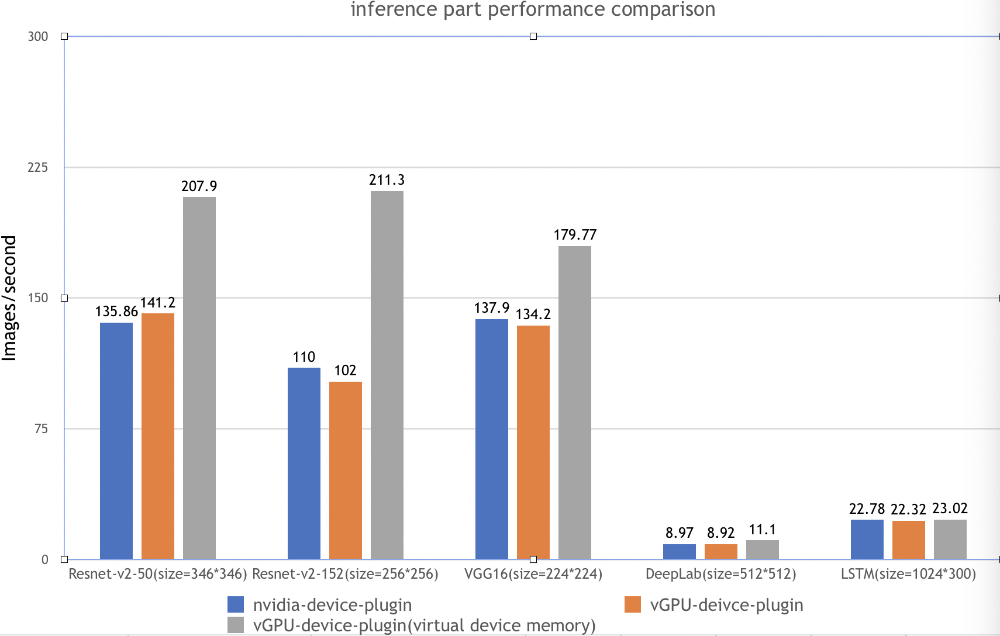
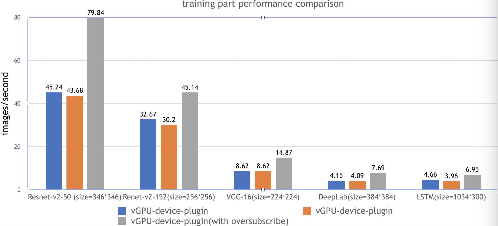

# vGPU device plugin for Kubernetes

[](https://github.com/4paradigm/k8s-device-plugin/actions/workflows/build.yml)
[](https://hub.docker.com/r/4pdosc/k8s-device-plugin)
[](https://join.slack.com/t/k8s-device-plugin/shared_invite/zt-oi9zkr5c-LsMzNmNs7UYg6usc0OiWKw)
[](https://github.com/4paradigm/k8s-device-plugin/discussions)

[English version](README.md)|中文版

## 目录

- [关于](#关于)
- [使用场景](#使用场景)
- [性能测试](#性能测试)
- [功能](#功能)
- [实验性功能](#实验性功能)
- [已知问题](#已知问题)
- [开发计划](#开发计划)
- [安装要求](#安装要求)
- [快速入门](#快速入门)
  - [GPU节点准备](#GPU节点准备)
  - [Kubernetes开启vGPU支持](#Kubernetes开启vGPU支持)
  - [运行GPU任务](#运行GPU任务)
- [测试](#测试)
- [问题反馈及代码贡献](#问题反馈及代码贡献)

## 关于

**vGPU device plugin** 基于NVIDIA官方插件([NVIDIA/k8s-device-plugin](https://github.com/NVIDIA/k8s-device-plugin))，在保留官方功能的基础上，实现了对物理GPU进行切分，并对显存和计算单元进行限制，从而模拟出多张小的vGPU卡。在k8s集群中，基于这些切分后的vGPU进行调度，使不同的容器可以安全的共享同一张物理GPU，提高GPU的利用率。此外，插件还可以对显存做虚拟化处理（使用到的显存可以超过物理上的显存），运行一些超大显存需求的任务，或提高共享的任务数，可参考[性能测试报告](#性能测试)。

## 使用场景

1. 显存、计算单元利用率低的情况，如在一张GPU卡上运行10个tf-serving。
2. 需要大量小显卡的情况，如教学场景把一张GPU提供给多个学生使用、云平台提供小GPU实例。
3. 物理显存不足的情况，可以开启虚拟显存，如大batch、大模型的训练。

## 性能测试

在测试报告中，我们一共在下面五种场景都执行了ai-benchmark 测试脚本，并汇总最终结果：

| 测试环境 | 环境描述                                              |
| ---------------- | :------------------------------------------------------: |
| Kubernetes version | v1.12.9                                                |
| Docker  version    | 18.09.1                                                |
| GPU Type           | Tesla T4                                               |

| 测试编号 |                      测试用例                      |
| -------- | :------------------------------------------------: |
| 1        |         k8s + nvidia官方k8s-device-plugin          |
| 2        |      k8s + VGPU k8s-device-plugin，无虚拟显存      |
| 3        | k8s + VGPU k8s-device-plugin，高负载，开启虚拟显存 |

测试内容

| test id |     名称      |   类型    |          参数           |
| ------- | :-----------: | :-------: | :---------------------: |
| 1.1     | Resnet-V2-50  | inference |  batch=50,size=346*346  |
| 1.2     | Resnet-V2-50  | training  |  batch=20,size=346*346  |
| 2.1     | Resnet-V2-152 | inference |  batch=10,size=256*256  |
| 2.2     | Resnet-V2-152 | training  |  batch=10,size=256*256  |
| 3.1     |    VGG-16     | inference |  batch=20,size=224*224  |
| 3.2     |    VGG-16     | training  |  batch=2,size=224*224   |
| 4.1     |    DeepLab    | inference |  batch=2,size=512*512   |
| 4.2     |    DeepLab    | training  |  batch=1,size=384*384   |
| 5.1     |     LSTM      | inference | batch=100,size=1024*300 |
| 5.2     |     LSTM      | training  | batch=10,size=1024*300  |

测试结果： 



测试步骤：

1. 安装nvidia-device-plugin，并配置相应的参数
2. 运行benchmark任务

```
$ kubectl apply -f benchmarks/ai-benchmark/ai-benchmark.yml
```

3. 通过kubctl logs 查看结果

```
$ kubectl logs [pod id]
```

## 功能

- 指定每张物理GPU切分的vGPU的数量
- 限制vGPU的显存
- 限制vGPU的计算单元
- 对已有程序零改动

## 实验性功能

- 虚拟显存

  vGPU的显存总和可以超过GPU实际的显存，这时候超过的部分会放到内存里，对性能有一定的影响。

## 已知问题

- 开启虚拟显存时，如果某张物理GPU的显存已用满，而这张GPU上还有空余的vGPU，此时分配到这些vGPU上的任务会失败。
- 目前仅支持计算任务，不支持视频编解码处理。

## 开发计划

- 支持视频编解码处理
- 支持Multi-Instance GPUs (MIG) 

## 安装要求

* NVIDIA drivers >= 384.81
* nvidia-docker version > 2.0 
* docker已配置nvidia作为默认runtime
* Kubernetes version >= 1.10

## 快速入门

### GPU节点准备

以下步骤要在所有GPU节点执行。这份README文档假定GPU节点已经安装NVIDIA驱动和`nvidia-docker`套件。

注意你需要安装的是`nvidia-docker2`而非`nvidia-container-toolkit`。因为新的`--gpus`选项kubernetes尚不支持。安装步骤举例：

```
# 加入套件仓库
$ distribution=$(. /etc/os-release;echo $ID$VERSION_ID)
$ curl -s -L https://nvidia.github.io/nvidia-docker/gpgkey | sudo apt-key add -
$ curl -s -L https://nvidia.github.io/nvidia-docker/$distribution/nvidia-docker.list | sudo tee /etc/apt/sources.list.d/nvidia-docker.list

$ sudo apt-get update && sudo apt-get install -y nvidia-docker2
$ sudo systemctl restart docker
```

你需要在节点上将nvidia runtime做为你的docker runtime预设值。我们将编辑docker daemon的配置文件，此文件通常在`/etc/docker/daemon.json`路径：

```
{
    "default-runtime": "nvidia",
    "runtimes": {
        "nvidia": {
            "path": "/usr/bin/nvidia-container-runtime",
            "runtimeArgs": []
        }
    }
}
```

> *如果 `runtimes` 字段没有出现, 前往的安装页面执行安装操作 [nvidia-docker](https://github.com/NVIDIA/nvidia-docker)*

### Kubernetes开启vGPU支持

当你在所有GPU节点完成前面提到的准备动作，如果Kubernetes有已经存在的NVIDIA装置插件，需要先将它移除。然后，你能通过下面指令下载我们的Daemonset yaml文件：

```
$ wget https://raw.githubusercontent.com/4paradigm/k8s-device-plugin/master/nvidia-device-plugin.yml
```

在这个DaemonSet文件中, 你能发现`nvidia-device-plugin-ctr`容器有一共4个vGPU的客制化参数：

* `fail-on-init-error:` 
  布尔类型, 预设值是true。当这个参数被设置为true时，如果装置插件在初始化过程遇到错误时程序会返回失败，当这个参数被设置为false时，遇到错误它会打印信息并且持续阻塞插件。持续阻塞插件能让装置插件即使部署在没有GPU的节点（也不应该有GPU）也不会抛出错误。这样你在部署装置插件在你的集群时就不需要考虑节点是否有GPU，不会遇到报错的问题。然而，这么做的缺点是如果GPU节点的装置插件因为一些原因执行失败，将不容易察觉。现在预设值为当初始化遇到错误时程序返回失败，这个做法应该被所有全新的部署采纳。
* `device-split-count:` 
  整数类型，预设值是2。NVIDIA装置的分割数。对于一个总共包含*N*张NVIDIA GPU的Kubernetes集群，如果我们将`device-split-count`参数配置为*K*，这个Kubernetes集群将有*K \* N*个可分配的vGPU资源。注意，我们不建议将NVIDIA 1080 ti/NVIDIA 2080 ti `device-split-count`参数配置超过5，将NVIDIA  T4配置超过7，将NVIDIA A100配置超过15。
* `device-memory-scaling:` 
  浮点数类型，预设值是1。NVIDIA装置显存使用比例，可以大于1（启用虚拟显存，实验功能）。对于有*M​*显存大小的NVIDIA GPU，如果我们配置`device-memory-scaling`参数为*S*，在部署了我们装置插件的Kubenetes集群中，这张GPU分出的vGPU将总共包含 *S \* M*显存。每张vGPU的显存大小也受`device-split-count`参数影响。在先前的例子中，如果`device-split-count`参数配置为*K*，那每一张vGPU最后会取得 *S \* M / K* 大小的显存。
* `device-cores-scaling:` 
  浮点数类型，预设值是1。NVIDIA装置算力使用比例，可以大于1。如果`device-cores-scaling​`参数配置为*S​* `device-split-count`参数配置为*K*，那每一张vGPU对应的**一段时间内** sm 利用率平均上限为*S \* M / K*。属于同一张物理GPU上的所有vGPU sm利用率总和不超过1。

完成这些可选参数的配置后，你能透过下面命令开启vGPU的支持：

```
$ kubectl apply -f nvidia-device-plugin.yml
```

### 运行GPU任务

NVIDIA vGPUs 现在能透过资源类型`nvidia.com/gpu`被容器请求：

```
apiVersion: v1
kind: Pod
metadata:
  name: gpu-pod
spec:
  containers:
    - name: ubuntu-container
      image: ubuntu:18.04
      command: ["bash", "-c", "sleep 86400"]
      resources:
        limits:
          nvidia.com/gpu: 2 # 请求2个vGPUs
```

现在你可以在容器执行`nvidia-smi`命令，然后比较vGPU和实际GPU显存大小的不同。

> **注意:** 如果你使用插件装置时，如果没有请求vGPU资源，那容器所在机器的所有vGPU都将暴露给容器。

## 测试

- TensorFlow 1.14.0/2.4.1
- torch1.1.0
- mxnet 1.4.0
- mindspore 1.1.1

以上框架均通过测试。

## 反馈和参与

* bug、疑惑、修改欢迎提在 [Github Issues](https://github.com/4paradigm/k8s-device-plugin/issues/new)
* 想了解更多或者有想法可以参与到[Discussions](https://github.com/4paradigm/k8s-device-plugin/discussions)和[slack](https://join.slack.com/t/k8s-device-plugin/shared_invite/zt-oi9zkr5c-LsMzNmNs7UYg6usc0OiWKw)交流

